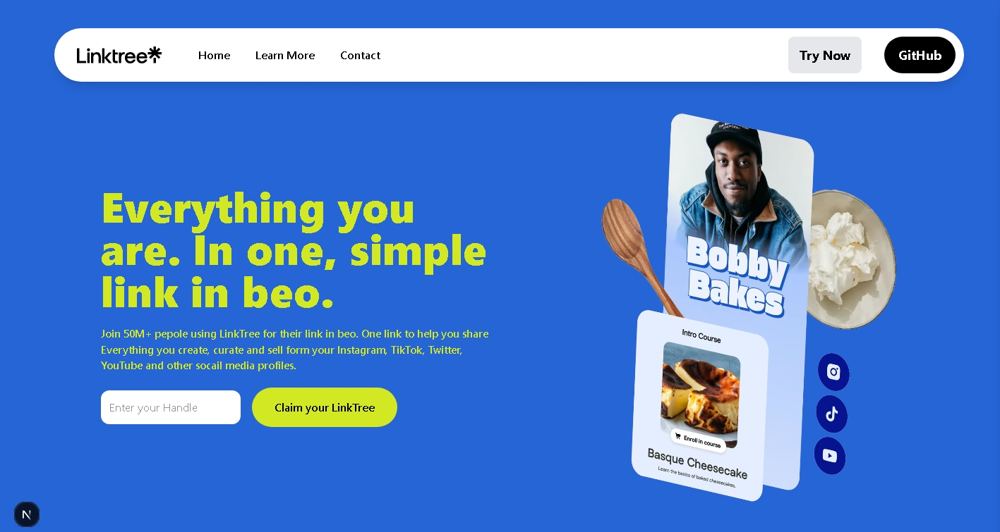
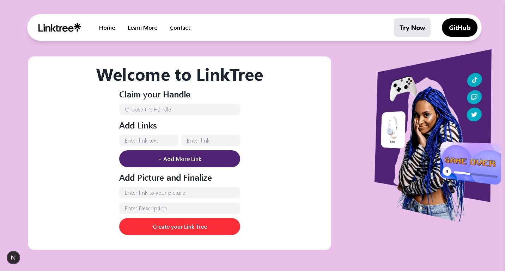
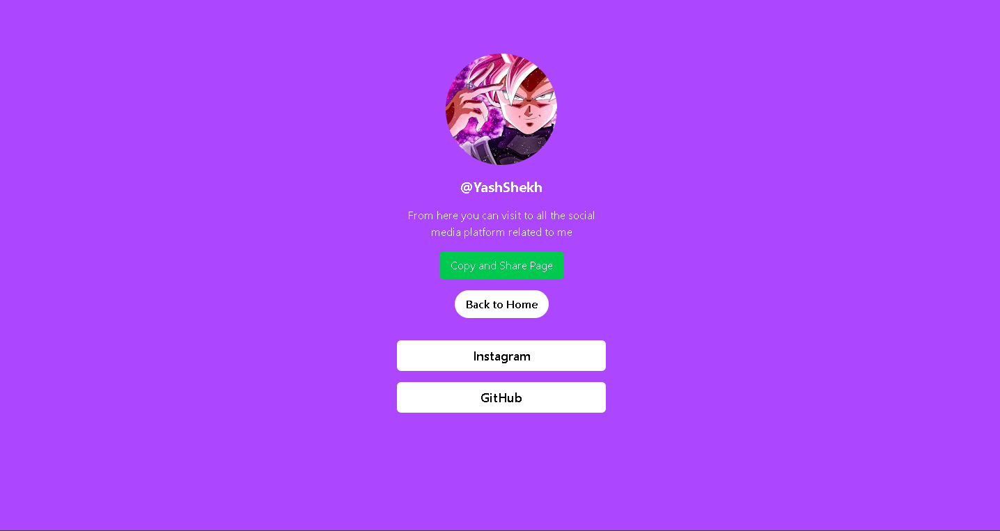

# 🔗 LinkTree Clone — Personal Link Management Platform

## Overview

This project is a full-stack **LinkTree-style web application** that allows users to create a personalized profile page containing multiple custom links that can be shared through a single URL.

The goal of this project was to understand dynamic routing, database integration in a modern full-stack environment.

---

## Features

* Unique username-based public profile pages
* Server-side data fetching
* Responsive and minimal UI
* Persistent data storage using MongoDB
* Dynamic routing using Next.js
* Shareable public profile URL

---

## Tech Stack

### Frontend

* Next.js
* React
* Tailwind CSS

### Backend

* Next.js Server Components & API Routes
* Node.js

### Database

* MongoDB

---

## How It Works

1. User chooses a unique handle (username)
2. Links are added through dashboard
3. Data stored in MongoDB
4. Public page generated dynamically at:

```
/[username]
```

Example:

```
yourdomain.com/yash
```

The page fetches user links from the database and renders them dynamically.

---

## Architecture

Client → Next.js Server → MongoDB → Dynamic Page Rendering

* Server fetches user data securely
* Dynamic routes render profile pages
* Database updates instantly reflect on public profile

---

## Screenshots

(Add screenshots here)

* home Page

* Add Link Form

* Public Profile Page



---

## Live Demo

🔗 Live Website: (https://link-tree-vert-six.vercel.app/)

---

## Installation

```bash id="wz1wru"
git clone https://github.com/Yash-Shekh/Link-Tree.git
cd linktree-clone
npm install
npm run dev
```

Create `.env.local`:

```id="m9y8kw"
MONGODB_URI=
NEXTAUTH_SECRET=
GITHUB_ID=
GITHUB_SECRET=
```

---

## Challenges & Fixes

* Implemented dynamic routing for username-based pages
* Fixed async data fetching issues in server components
* Managed database queries efficiently for public pages

---

## Key Learnings

* Dynamic routing in Next.js App Router
* Full CRUD operations with MongoDB
* Server vs Client component separation
* Real-world data fetching patterns

---

## Future Improvements

* Custom themes for profile pages
* Drag-and-drop link ordering
* Analytics for link clicks
* Profile customization options

---

## Author

**Yash Shekh**
Full Stack Web Developer

GitHub: (https://github.com/Yash-Shekh)

Portfolio: (https://portfolio-five-roan-2czwexom59.vercel.app/)
